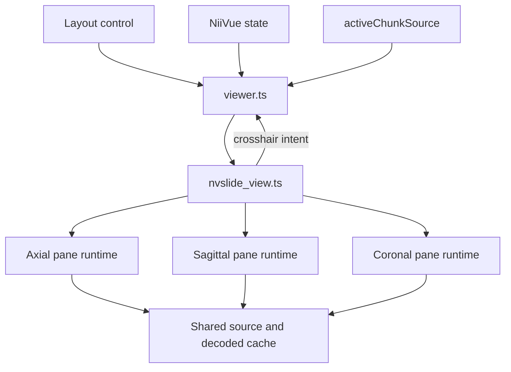

# Permanent orthogonal NVSlide layout

## Decision

Zarro starts with **NVSlide axial focus**. The layout uses a large axial pane and smaller sagittal and coronal panes. An explicit `layout` value in a share URL overrides this default.

NiiVue remains the owner of the loaded volume, the display window, the normalized three-dimensional crosshair, and shareable view state. The NVSlide view projects that state into three two-dimensional panes and reports navigation intents to `viewer.ts`.



## Layout boundary

`viewer_layout.ts` returns a discriminated layout:

```ts
type ViewerLayoutConfig =
  | { kind: 'niivue'; niivue: NiiVueLayoutConfig }
  | {
      kind: 'nvslide'
      arrangement: 'axial-focus'
      niivue: NiiVueLayoutConfig
    }
```

The numeric layout ID remains an HTML and URL boundary value. Layout `34` selects NVSlide. An unknown value falls back to the existing axial-focus layout and never reaches `NiiVue.sliceType`.

## Runtime ownership

`nvslide_view.ts` owns the pane DOM bindings, gestures, render scheduling, resize handling, and runtime disposal. Each pane owns one canvas, one WebGL2 context, one `SlideRenderer`, one `NVSlide`, and one cancellable `VolumePlaneSource`.

The panes share `activeChunkSource`. The source and decoded caches below that interface remain shared. NVSlide tile caches and WebGL textures remain isolated because `SlideRenderer` texture keys do not include a slide identity.

The total NVSlide tile-cache budget is 256 MiB:

- Axial: 128 MiB.
- Sagittal: 64 MiB.
- Coronal: 64 MiB.

Leaving the NVSlide layout releases all three pane runtimes.

## Plane geometry

`volume_plane_source.ts` defines each plane with two in-plane axes and one normal axis:

| Plane | Horizontal | Vertical | Normal |
| --- | --- | --- | --- |
| Axial | X | Y | Z |
| Sagittal | Y | Z | X |
| Coronal | X | Z | Y |

The canonical crosshair is a normalized XYZ tuple. Each pane derives its normal slice from that tuple. Clicks replace the two in-plane components and preserve the normal component.

The manifest uses physical in-plane extents, normalized by the smallest base voxel spacing. Level tile dimensions remain native voxel dimensions. NVSlide already maps level width and height independently into manifest coordinates, so this preserves anisotropic aspect ratio without CPU resampling.

## Updates and disposal

The controller rebuilds only the pane whose normal slice changes. A source, active stain, or display-window change rebuilds all panes. An in-plane crosshair change only moves an overlay.

The display window remains part of the pane identity because `VolumePlaneSource` converts scalar voxels to RGBA. `commitAppliedWindow()` synchronizes the controller after automatic or manual contrast is committed.

`VolumePlaneSource` owns an `AbortController`. Pane replacement uses this order:

1. Cancel the animation frame.
2. Detach the slide listener.
3. Abort the source and clear its host.
4. Dispose the slide.
5. Clear or destroy the renderer.

A generation check prevents a late fetch from notifying a replacement slide.

## Interaction

All panes share one crosshair. Dragging pans one pane. The wheel zooms one pane around the pointer. A short click moves the shared crosshair. A double click fits that pane around the current crosshair.

Pane-local viewports avoid forcing the small reference panes and the main pane to use the same pixel-space viewport. The main crosshair, display window, and selected layout remain shareable. Secondary pan and zoom are session-local.

The measurement control switches NVSlide gestures from navigation to distance measurement. Each pane projects the drag endpoints into the shared NiiVue world-space measurement model and draws the measurements that intersect its current slice. Right-click removes a measurement, and the shared clear control removes all measurements. Each NVSlide pane draws its own metric scale bar from its local viewport and physical in-plane spacing. Each pane also reports its own pending tile count. The pane markup keeps anatomical names in accessibility labels but does not draw visible anatomical labels.

The active pane owns the NIfTI field of view. Focus, click, drag, wheel, and double-click interactions make a pane active, and a green inset outline shows that choice. The pane's visible rectangle defines the two in-plane export bounds. The normal-axis crop stays centered on the shared crosshair and uses the larger visible in-plane fraction as its depth fraction. This rule preserves Zarro's volumetric field-of-view export while the three panes use independent cameras. The existing world-bounds mapping preserves the same physical crop when the user selects another NIfTI pyramid level.

Grayscale windowing supports the current NVSlide behavior. Multi-stain compositing and non-gray colour maps remain renderer capability gaps.

## Rejected designs

One shared renderer was rejected because all slides would fill one canvas and plane tiles could collide in the renderer texture cache.

Three top-level controllers were rejected because `viewer.ts` would have to coordinate three source generations, cache budgets, and disposal paths.

CPU resampling was rejected because it adds work to every orthogonal tile. Physical manifest coordinates provide the required aspect correction while retaining native pyramid tiles.

A second canonical camera was rejected because layout switching would require reconciling two crosshairs, two display windows, and two share-state models.
